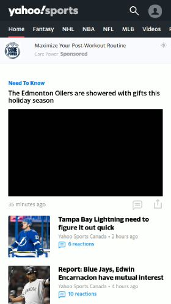
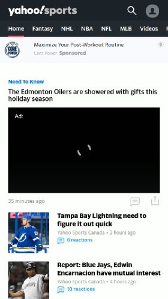

# Outliers where Largest Contentful Paint differs from Speed Index

If you look at the [scatter plots](https://datastudio.google.com/c/u/0/reporting/1sCHMXg3hgza3vqNVhDFAftYRgI94s2da/page/QDj4),
you'll see some dots that are outliers, where Largest Contentful Paint doesn't really match Speed Index.

I picked a few of these outliers in the mobile chart, and looked into them using the following method:
* Loaded page in Chrome devtools performance panel to find the timing and element that was the Largest Contentful Paint
* Saved the timeline and ran it through [speedline](https://github.com/paulirish/speedline) to get the Speed Index.

## Outliers where Largest Contenful Paint is much later than Speed Index

HttpArchive on mobile uses a slow network connection, and the mobile outliers I saw where Largest Contentful Paint
was much later than Speed Index all had a slow-loading hero image as the Largest Contentful Paint. For images, largest
contentful paint occurs when the image is fully loaded and painted, which can be significantly later than speed
index on slow connections for pages with very large images. I believe this behavior lines up well with the metric's intent of
measuring when main content is displayed, but in some cases the user may have difficulty distinguishing when the image
is fully loaded vs mostly loaded, such as the news.google.com case below.

### https://files.google.com

On this page, the Largest Contentful Paint is a big hero image which takes a long time to load under slow network conditions.
Many visual updates occur during this time, and since Speed Index is an average it occurs earlier in the load.

1664ms: First paint | 3002ms: Speed Index | 5533ms: Hero image still loading | 8686ms: Hero image loaded, LCP
------------------- | ------------------- | -------------------------------- | ------------------------------
 |  |  | 

### https://news.google.com

On this page, the hero image is the Largest Contentful Paint, and it takes a long time to fully download.
It's a little difficult to see in the filmstrip that it's not loaded until the last screenshot.
Speed index occurs sooner because it's averaging when things are displayed.

7372ms | 7438ms | 7589ms | 7622ms: Speed Index | 7856ms: Hero image finishes loading
------ | ------ | ------ | ------------------- | -----------------------------------
 |  |  |  | 

## Outliers where Largest Contenful Paint is much earlier than Speed Index

All the outliers I dug into when Largest Contentful Paint occurred much earlier than Speed Index had a text paint
as the Largest Contentful Paint. The text painted before smaller images or lazy-loaded ads. I believe that this
meets the metric's goal of measuring when the main content is displayed, while Speed Index acts more like a
visual completeness metric in these cases.

### https://ca.sports.yahoo.com

On this site, the hero image is replaced with an ad, so the Largest Contentful Paint is its accompanying headline.
Most of the content is available at the time of the Largest Contentful Paint, but Speed Index tracks the video ad
starting to load.

**Speed Index occurs at 6241ms in this example, which is not visible in the filmstrip**

1734ms | 1935ms: LCP | 2968ms: hero image removed | 5154ms: ad starts loading | 6688ms: ad loading
------ | ----------- | -------------------------- | ------------------------- | ------------------
 |  |  |  | 

### http://wap.baidu.com/

The Largest Contentful Paint on this page is a text paragraph. The full text content of the page paints quickly, but
smaller images load in slowly over the next few seconds, causing Speed Index to be later.

**Speed Index occurs at 2714ms in this example, which is not visible in the filmstrip**

1838ms | 1871ms | 2088ms: LCP | 3256ms | 3556ms
------ | ------ | ----------- | ------ | ------
 |  |  |  | 
